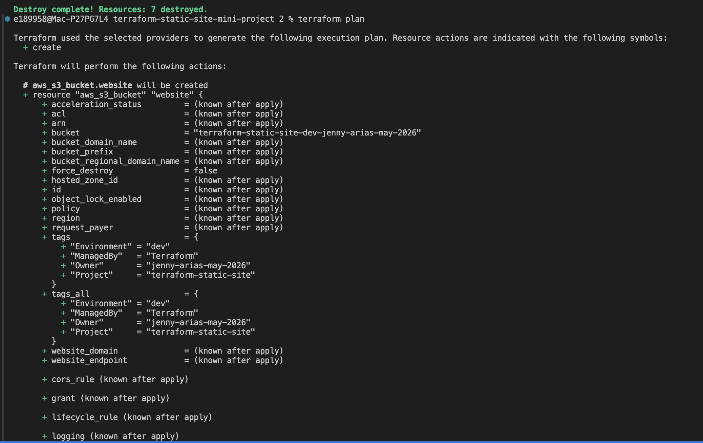
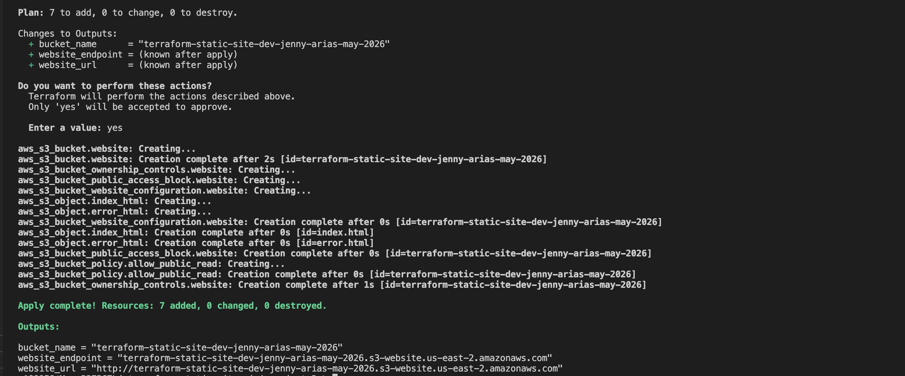
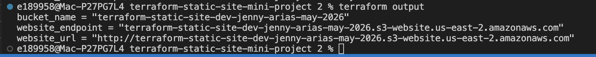
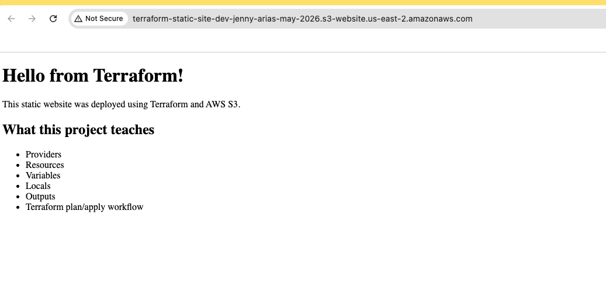
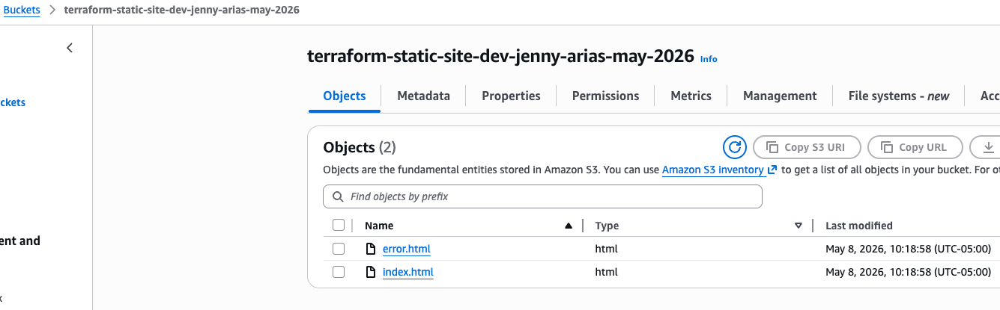
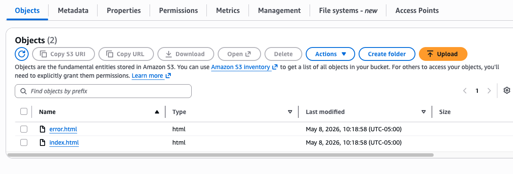
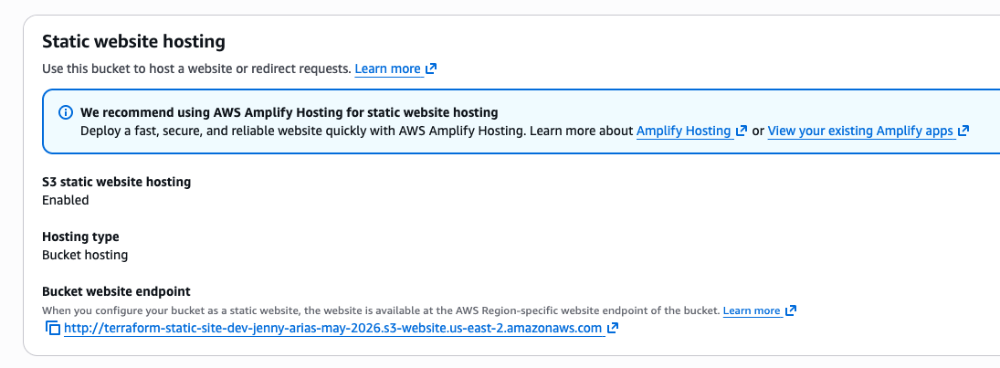
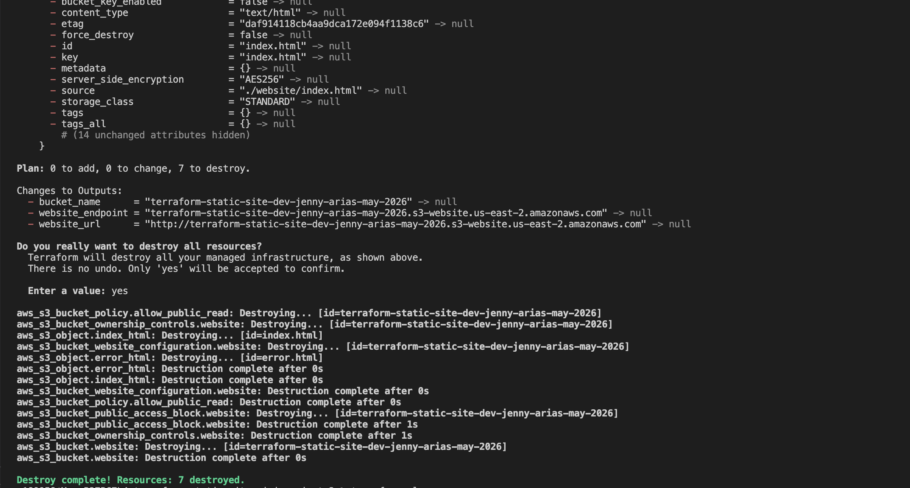

# Terraform Static Website Mini Project

## Overview

This project is a beginner-friendly Terraform project that provisions a simple AWS S3 static website.

The purpose of this project is to demonstrate the foundational structure of a Terraform project while explaining the core concepts used in Infrastructure as Code (IaC).

Rather than focusing only on deployment, this repository is designed to serve as a learning reference for:

- Terraform fundamentals
- AWS infrastructure provisioning
- Infrastructure as Code workflows
- Terraform project structure
- State management concepts
- Variables, outputs, locals, and providers
- S3 static website hosting

This project intentionally keeps the infrastructure small and understandable so the Terraform workflow can be learned step-by-step.

---

# What Is Terraform?

Terraform is an Infrastructure as Code (IaC) tool.

Instead of manually creating cloud infrastructure through the AWS Console, Terraform allows infrastructure to be defined in code using `.tf` files.

Terraform then compares the desired infrastructure in code against the real infrastructure in AWS and determines what needs to be created, updated, or removed.

In simple terms:

> Terraform allows cloud infrastructure to be version-controlled, repeatable, and deployable through code.

---

# Why Terraform Matters

Terraform helps teams:

- Standardize infrastructure deployments
- Reduce manual configuration errors
- Review infrastructure changes safely
- Reuse infrastructure patterns across environments
- Track infrastructure changes through Git
- Automate deployments through CI/CD pipelines

Terraform is commonly used with services such as:

- AWS
- Azure
- Google Cloud
- Databricks
- Kubernetes
- GitHub
- Snowflake

---

# Project Architecture

This project creates:

1. An AWS S3 bucket
2. Static website hosting configuration
3. Public read access policy
4. Website files (`index.html` and `error.html`)
5. Terraform outputs for the deployed endpoint

High-level flow:

```text
Terraform Code
    ↓
terraform init
    ↓
terraform plan
    ↓
terraform apply
    ↓
AWS S3 Static Website
```

---

# Project Structure

```text
terraform-static-site-mini-project/
│
├── docs/
│   ├── AWS_CREDENTIALS_WALKTHROUGH.md
│   └── TERRAFORM_BEGINNER_GUIDE.md
│
├── screenshots/
│
├── website/
│   ├── index.html
│   └── error.html
│
├── main.tf
├── variables.tf
├── locals.tf
├── outputs.tf
├── providers.tf
├── terraform.tfvars.example
├── .gitignore
└── README.md
```

---

# Additional Learning Guides

This repository also includes additional beginner documentation:

| File | Purpose |
|---|---|
| `docs/TERRAFORM_BEGINNER_GUIDE.md` | Explains Terraform concepts and project structure from scratch |
| `docs/AWS_CREDENTIALS_WALKTHROUGH.md` | Explains AWS CLI authentication and Terraform credential usage |

---

# What Each Terraform File Does

## providers.tf

Defines:

- Terraform version requirements
- Provider plugins Terraform should use

Example:

```hcl
provider "aws" {
  region = var.aws_region
}
```

This tells Terraform to use the AWS provider and deploy resources into the configured AWS region.

---

## variables.tf

Defines reusable input variables.

Example:

```hcl
variable "environment" {
  description = "Environment name"
  type        = string
}
```

Variables help avoid hardcoding values throughout the project.

---

## terraform.tfvars

Provides the actual values for Terraform variables.

Example:

```hcl
environment = "dev"
owner       = "jenny-arias"
```

This file allows the same Terraform code to be reused across different environments.

---

## locals.tf

Defines reusable calculated values.

Example:

```hcl
locals {
  bucket_name = "${var.project}-${var.environment}-${var.owner}"
}
```

Locals help reduce repeated logic throughout Terraform resources.

---

## main.tf

Contains the infrastructure resources Terraform creates.

This project provisions:

- S3 bucket
- Website configuration

---

## outputs.tf

Displays useful values after deployment.

Example:

```hcl
output "website_url" {
  value = "http://${aws_s3_bucket_website_configuration.website.website_endpoint}"
}
```

Outputs are commonly used for:

- URLs
- ARNs
- bucket names
- IDs
- role names

---

# Terraform Workflow

## Step 1 — Initialize Terraform

```bash
terraform init
```

This downloads required provider plugins and initializes the working directory.

---

## Step 2 — Format Terraform Files

```bash
terraform fmt
```

Formats Terraform code consistently.

---

## Step 3 — Validate Terraform Configuration

```bash
terraform validate
```

Checks for syntax or configuration issues.

---

## Step 4 — Preview Infrastructure Changes

```bash
terraform plan
```

Shows what Terraform intends to create, modify, or destroy.

---

## Step 5 — Deploy Infrastructure

```bash
terraform apply
```

Creates the infrastructure resources in AWS.

---

## Step 6 — Destroy Infrastructure

```bash
terraform destroy
```

Deletes infrastructure resources managed by Terraform.

This is important for learning projects to avoid leaving cloud resources running unnecessarily.

---

# AWS Credentials Setup

Terraform uses AWS credentials through the AWS provider.

This project was configured using a personal AWS CLI profile instead of company credentials.

Credential validation was tested using:

```bash
aws sts get-caller-identity
```

Additional AWS credential setup details are documented in:

```text
docs/AWS_CREDENTIALS_WALKTHROUGH.md
```

---

# Key Terraform Concepts Demonstrated

## Providers

Providers are plugins Terraform uses to communicate with platforms such as AWS.

Example:

```hcl
provider "aws" {}
```

---

## Resources

Resources are the actual infrastructure objects Terraform creates.

Examples:

- S3 buckets
- Lambda functions
- DynamoDB tables
- IAM policies

---

## Variables

Variables allow reusable configuration values.

---

## Locals

Locals define reusable calculated values inside Terraform.

---

## Outputs

Outputs display useful deployment information after infrastructure creation.

---

## Terraform State

Terraform tracks infrastructure using a state file:

```text
terraform.tfstate
```

The state file maps Terraform code to real infrastructure resources.

This project also demonstrated a real-world Terraform state issue during testing, where old S3 bucket references remained in state after configuration changes. The issue was resolved by reinitializing Terraform state locally.

---

# Project Screenshots

## Terraform Plan

Terraform previewing the infrastructure resources before deployment.



---

## Terraform Apply Success

Terraform successfully created the S3 static website resources.



---

## Terraform Outputs

Terraform outputs displaying the deployed bucket name and website endpoint.



---

## Static Website in Browser

The deployed S3 static website successfully loaded in the browser.



---

## S3 Bucket Created

The S3 bucket created by Terraform in AWS.



---

## Uploaded Website Files

Terraform uploaded `index.html` and `error.html` into the S3 bucket.



---

## Static Website Hosting Enabled

S3 static website hosting enabled for the bucket.



---

## Terraform Destroy Success

Terraform successfully destroyed the infrastructure resources after testing.



---

# What This Project Demonstrates

This project demonstrates:

- Terraform project organization
- Infrastructure as Code fundamentals
- AWS provider configuration
- S3 static website hosting
- Terraform variables and outputs
- Local values
- Terraform state behavior
- AWS CLI authentication
- Infrastructure deployment lifecycle
- Resource cleanup workflows

---

# Future Improvements

Potential future enhancements:

- Add remote Terraform state using S3
- Add DynamoDB state locking
- Add CloudFront CDN
- Add Route53 custom domain
- Add GitHub Actions CI/CD validation
- Convert resources into reusable Terraform modules
- Add multi-environment deployment structure

---

# Notes

This project was created as part of a hands-on cloud and infrastructure learning journey focused on building practical Terraform experience and understanding Infrastructure as Code concepts through real AWS deployments.